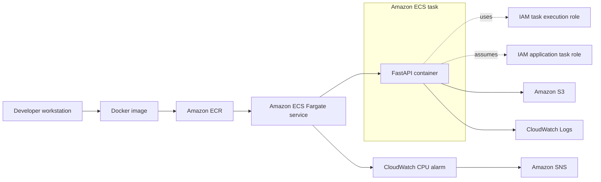

# AWS Cloud-Native Deployment and Observability Lab

A production-oriented FastAPI deployment lab demonstrating container delivery, managed orchestration, IAM-based AWS access, S3 integration, centralized logging, monitoring, alarms, and task recovery on AWS.

## Project Overview

This portfolio project documents a practical path from a local FastAPI application to a containerized workload on Amazon ECS with AWS Fargate. It demonstrates image delivery through Amazon ECR, role-based access to an S3 object, CloudWatch logging and CPU monitoring, an Amazon SNS alarm notification, and ECS service recovery when a task is stopped.

The repository is intentionally a focused deployment and observability lab. The `/predict` route is a demonstration rule-based endpoint that adds two input values; it is not an inference endpoint backed by a trained machine-learning model.

## Architecture



See [docs/architecture.md](docs/architecture.md) for a concise component explanation.

## AWS Services Demonstrated

- **Amazon ECR** stores versioned Docker images.
- **Amazon ECS with AWS Fargate** runs the container through a managed service and task definition.
- **AWS IAM** separates image-pull/log-delivery permissions from application S3 permissions.
- **Amazon S3** stores `model-info.json`, which the application reads at runtime.
- **Amazon CloudWatch Logs** centralizes container logs.
- **Amazon CloudWatch Alarms** monitors ECS service CPU utilization.
- **Amazon SNS** receives the configured alarm notification.
- **Amazon EC2** was used in the learning workflow for ECR image push access and a key pair; it is not part of the documented Fargate application runtime.

## Application Endpoints

| Method | Path | Purpose |
| --- | --- | --- |
| `GET` | `/` | Returns the API branding message. |
| `GET` | `/health` | Returns a simple process health response. |
| `POST` | `/predict` | Demonstration rule-based prediction that adds `feature_1` and `feature_2`. |
| `GET` | `/model-info` | Reads and returns model metadata from the configured S3 bucket and object key. |

FastAPI also exposes interactive OpenAPI documentation at `/docs` and `/redoc`.

Example request body for `/predict`:

```json
{
  "feature_1": 2.5,
  "feature_2": 3.0
}
```

## Deployment Workflow

1. Build and tag the Docker image on the developer workstation.
2. Authenticate Docker to Amazon ECR and push the selected image tag.
3. Register a new revision of the `aws-fastapi-demo-task` task definition when the container or task configuration changes.
4. Update `aws-fastapi-demo-service` to use the intended task-definition revision.
5. Let ECS replace the running task and maintain the service's desired task count.
6. Verify the health endpoint, S3 metadata access, CloudWatch logs, and alarm configuration.

The current repository does not include infrastructure-as-code or an automated deployment pipeline. See [docs/deployment-workflow.md](docs/deployment-workflow.md) for the workflow boundaries.

## IAM and Security Design

The deployment uses separate IAM responsibilities:

- `ecsTaskExecutionRole` allows the ECS agent to perform platform operations such as pulling the image from ECR and delivering container logs.
- `aws-fastapi-demo-s3-task-role` supplies application credentials to the running task.
- `aws-fastapi-demo-s3-read-policy` grants the application task role the S3 read access required for the metadata object.
- `EC2-ECR-PushRole` supports the separate image-push learning workflow and is not the application's runtime role.

No AWS credentials are stored in application code. Local `.env`, AWS credential directories, key files, and PEM files are excluded through `.gitignore`. The exact policy document is not stored in this repository, so least-privilege scope should be verified in AWS before reuse.

## Observability and Recovery

Application container logs are sent to CloudWatch Logs. The `aws-fastapi-demo-high-cpu` alarm monitors the ECS service's CPU signal and connects to Amazon SNS for notification.

The ECS service also demonstrates automatic task replacement: when a managed task stops, ECS launches a replacement to restore the configured desired count. This is service-level recovery, not evidence of a highly available or multi-Region architecture. The `/health` endpoint is a simple application response and does not validate S3 or other downstream dependencies.

## Repository Structure

```text
.
|-- docs/
|   |-- architecture.md
|   |-- aws-resources.md
|   `-- deployment-workflow.md
|-- .gitignore
|-- Dockerfile
|-- main.py
|-- README.md
`-- requirements.txt
```

`main.py` contains the FastAPI application, while `Dockerfile` defines the runtime image. The `docs/` directory holds supporting architecture, resource, and deployment notes.

## Run Locally

Python 3.12 is the container baseline. Create a virtual environment and install the pinned dependencies:

```bash
python -m venv .venv
```

Activate it on PowerShell:

```powershell
.\.venv\Scripts\Activate.ps1
python -m pip install -r requirements.txt
python -m uvicorn main:app --reload
```

Or activate it on macOS/Linux:

```bash
source .venv/bin/activate
python -m pip install -r requirements.txt
python -m uvicorn main:app --reload
```

Open `http://localhost:8000/docs`. The local process needs AWS credentials with permission to read the configured S3 object for `/model-info`; the other application endpoints do not require S3 access.

Optional environment overrides:

```text
S3_BUCKET_NAME=chathuranga-ai-ml-artifacts-2026
S3_OBJECT_KEY=model-info.json
```

## Run with Docker

Build and run the container locally:

```bash
docker build -t aws-fastapi-demo:latest .
docker run --rm -p 8000:8000 aws-fastapi-demo:latest
```

To call `/model-info` from a local container, provide an approved AWS credential mechanism and the S3 environment settings. Do not bake credentials into the image or commit them to the repository.

## AWS Resource Inventory

| Resource type | Existing name or identifier |
| --- | --- |
| Local Docker images | `aws-fastapi-demo:latest`, `aws-fastapi-demo:s3-v1` |
| ECR repository | `aws-fastapi-demo` |
| ECR image tags | `latest`, `s3-v1` |
| ECS cluster | `aws-fastapi-demo-cluster` |
| ECS service | `aws-fastapi-demo-service` |
| ECS task definition family | `aws-fastapi-demo-task` |
| Task-definition revisions | `aws-fastapi-demo-task:1`, `aws-fastapi-demo-task:2`, `aws-fastapi-demo-task:3` |
| S3 bucket | `chathuranga-ai-ml-artifacts-2026` |
| S3 object | `model-info.json` |
| IAM roles | `EC2-ECR-PushRole`, `ecsTaskExecutionRole`, `aws-fastapi-demo-s3-task-role` |
| IAM inline policy | `aws-fastapi-demo-s3-read-policy` |
| CloudWatch alarm | `aws-fastapi-demo-high-cpu` |
| EC2 key pair file | `aws-learning-ec2-key.pem` |

The AWS resources retain their original learning-project names. The portfolio repository's target slug is `aws-cloud-deployment-observability-lab`; changing the remote repository name is outside this documentation-only update. A categorized inventory is available in [docs/aws-resources.md](docs/aws-resources.md).

## Cost-Control Strategy

- Keep the ECS service desired count at the minimum needed for a demonstration.
- Stop or scale down compute resources when the lab is not being used.
- Remove unneeded ECR image versions and set an appropriate log-retention period.
- Keep S3 contents small and review CloudWatch alarm and SNS usage.
- Use AWS Budgets or billing alerts outside this repository to track account-level spend.

AWS Fargate, CloudWatch, ECR, S3, SNS, and related data transfer can incur charges. Resource cleanup remains a manual operational responsibility.

## Limitations

- `/predict` is a deterministic rule-based demonstration, not a trained model or real machine-learning production system.
- The repository does not define AWS infrastructure as code, CI/CD automation, or automated teardown.
- The documented deployment does not establish enterprise-grade, highly available, multi-Region, or full MLOps capabilities.
- The health endpoint reports process responsiveness only; it does not check S3 connectivity or deployment health end to end.
- Authentication, authorization for API callers, TLS termination, load balancing, autoscaling policy details, and persistent application data are not implemented in this repository.
- AWS resource settings and live status cannot be reproduced or audited from source alone.

## Future Improvements

- Add infrastructure as code for reproducible, reviewable resource creation and teardown.
- Add automated tests for endpoint contracts and mocked S3 behavior.
- Add a basic CI workflow for linting and tests.
- Add deployment validation and rollback instructions.
- Document explicit log retention, alarm thresholds, and resource cleanup steps.
- Add API authentication and dependency-aware health checks if the lab scope expands.
