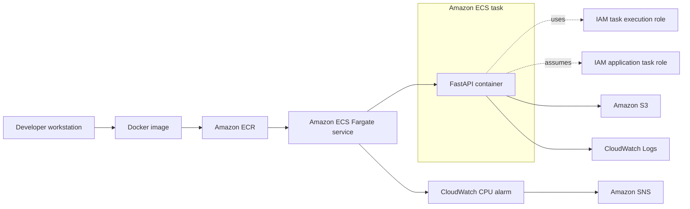

# Architecture

The lab packages a FastAPI application as a Docker image, stores versioned images in Amazon ECR, and runs the selected image through an Amazon ECS service using AWS Fargate.

## Component Responsibilities

- The developer workstation builds and tags the Docker image.
- Amazon ECR stores the `latest` and `s3-v1` image tags.
- The ECS Fargate service manages tasks based on revisions of `aws-fastapi-demo-task`.
- The task execution role supports platform actions such as image pulls and log delivery.
- The application task role provides the running API with S3 read access.
- Amazon S3 stores `model-info.json`, which is returned by `/model-info`.
- CloudWatch centralizes logs and monitors ECS service CPU; the configured alarm connects to Amazon SNS.
- ECS replaces a stopped service task to restore the configured desired count.

This design documents the implemented learning lab. It does not establish load-balanced, multi-Region, highly available, or enterprise-grade operation.
